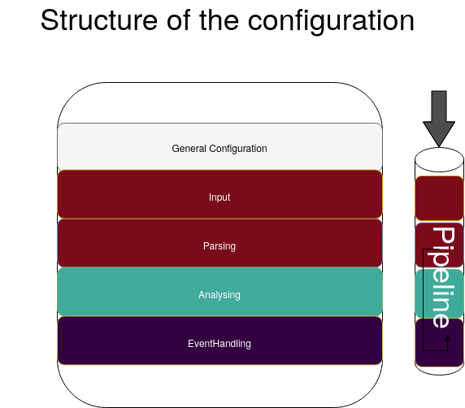
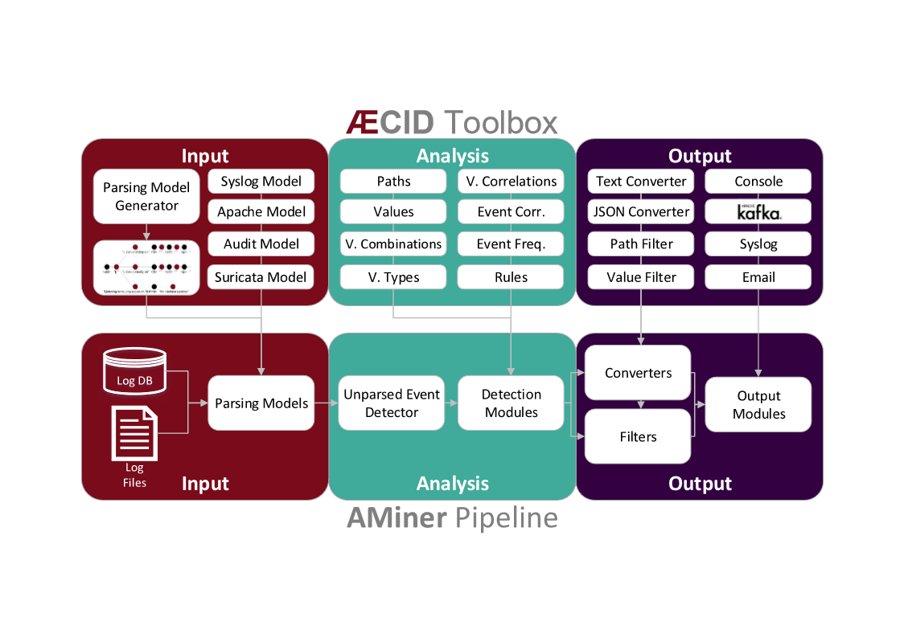

.. _Overview:

========
Overview
========

The logdata-anomaly-miner can be configured in two different formats: **yaml** and **python**. The preferred format is yaml and the default configuration file for it is */etc/aminer/config.yaml*. The python format can be configured in */etc/aminer/config.py* and offers advanced possibilities to configure the logdata-anomaly-miner. However, this is only recommended for experts, as no errors are caught in the python configuration, which can make debugging very difficult. For both formats there are template configurations in */etc/aminer/template\_config.yaml* and */etc/aminer/template\_config.py*.

The basic structure of the logdata-anomaly-miner is illustrated in the folloging diagram:

-----------------
Analysis Pipeline
-----------------

The core component of the logdata-anomaly-miner is the "analysis pipeline". It consists of the parts INPUT, ANALYSIS and OUTPUT.

=======================
Command-line Parameters
=======================

----------
-h, --help
----------

Show the help message and exit.

-------------
-v, --version
-------------

Show program's version number and exit.

-------------------
-u, --check-updates
-------------------

Check if updates for the aminer are available and exit.

--------------------------
-c CONFIG, --config CONFIG
--------------------------

* Default: /etc/aminer/config.yml

Use the settings of the file CONFIG on startup. Two config-variants are allowed: python and yaml.

.. seealso::

   :ref:`Overview`

------------
-D, --daemon
------------

Run aminer as a daemon process.

--------------------------
-s {0,1,2}, --stat {0,1,2}
--------------------------

Set the stat level. Possible stat-levels are 0 for no statistics, 1 for normal statistic level and 2 for verbose statistics.

---------------------------
-d {0,1,2}, --debug {0,1,2}
---------------------------

Set the debug level. Possible debug-levels are 0 for no debugging, 1 for normal output (INFO and above), 2 for printing all debug information.

--------------
--run-analysis
--------------

Run aminer analysis-child.

.. note:: This parameter is for internal use only.

-----------
-C, --clear
-----------

Remove all persistence directories and run aminer.

--------------------------
-r REMOVE, --remove REMOVE
--------------------------

Remove a specific persistence directory. REMOVE must be the name of the directory and must not contain '/' or '.'. Usually this directory can be found in '/var/lib/aminer'.

-----------------------------
-R RESTORE, --restore RESTORE
-----------------------------

Restore a persistence backup. RESTORE must be the name of the directory and must not contain '/' or '.'. Usually this directory can be found in '/var/lib/aminer'.

----------------
-f, --from-begin
----------------

Removes repositioning data before starting the aminer so that all input files will be analyzed starting from the first line in the file rather than the last previously analyzed line.

------------------
-o, --offline-mode
------------------

Stop the aminer after all logs have been processed.

.. note:: This parameter is useful for forensic analysis.

---------------------------------------------
--config-properties KEY=VALUE [KEY=VALUE ...]
---------------------------------------------

Set a number of config_properties by using key-value pairs (do not put spaces before or after the = sign). If a value contains spaces, you should define it with double quotes: 'foo="this is a sentence". Note that values are always treated as strings. If values are already defined in the config_properties, the input types are converted to the ones already existing.

=======================
Configuration Reference
=======================

---------------------
General Configuration
---------------------

LearnMode
~~~~~~~~~

* Type: boolean (True,False)
* Default: False

This options turns the LearnMode on globally.

.. warning:: This option can be overruled by the learn_mode that is configurable per analysis component.

.. code-block:: yaml

   LearnMode: True

AminerUser
~~~~~~~~~~

* Default: aminer

This option defines the system-user that owns the aminer-process.

.. code-block:: yaml

   AminerUser: 'aminer'

AminerGroup
~~~~~~~~~~~

* Default: aminer

This option defines the system-group that owns the aminer-process.

.. code-block:: yaml

   AminerGroup: 'aminer'

AnalysisConfigFile
~~~~~~~~~~~~~~~~~~

* Default: None

This (optional) configuration file contains the whole analysis child configuration (code). When missing those configuration parameters are also taken from the main config.

.. warning:: This option is only available for python configs. It does not work for yaml configs.

.. code-block:: python

   config_properties['AnalysisConfigFile'] = 'analysis.py'

RemoteControlSocket
~~~~~~~~~~~~~~~~~~~

This option controls where the unix-domain-socket for the RemoteControl should be created. The socket will not be created if this option is not set.

.. code-block:: yaml

   RemoteControlSocket: '/var/lib/aminer/remcontrol.sock'

SuppressNewMatchPathDetector
~~~~~~~~~~~~~~~~~~~~~~~~~~~~

* Default: False
* Type: boolean (True,False)

Disable the output of the NewMatchPathDetector which detects new paths for logtypes.

.. code-block:: yaml

   SuppressNewMatchPathDetector: False

LogResourceList
~~~~~~~~~~~~~~~

* Required: **True**
* Resource-Types: ``file://``, ``unix://``

Define the list of log resources to read from: the resources named here do not need to exist when aminer is started. This will just result in a warning. However if they exist, they have to be readable by the aminer process!

Supported types are:

* file://[path]: Read data from file, reopen it after rollover
* unix://[path]: Open the path as UNIX local socket for reading

.. code-block:: yaml

   LogResourceList:
       - 'file:///var/log/apache2/access.log'
       - 'file:///home/ubuntu/data/mail.cup.com-train/daemon.log'
       - 'file:///home/ubuntu/data/mail.cup.com-train/auth.log'
       - 'file:///home/ubuntu/data/mail.cup.com-train/suricata/eve.json'
       - 'file:///home/ubuntu/data/mail.cup.com-train/suricata/fast.log'

Core.PersistenceDir
~~~~~~~~~~~~~~~~~~~

* Default: /var/lib/aminer

Read and store information to be used between multiple executions of aminer in this directory. The directory must only be accessible to the 'AminerUser' but not group/world readable. On violation, aminer will refuse to start.

.. code-block:: yaml

   Core.PersistenceDir: '/var/lib/aminer'

Core.PersistencePeriod
~~~~~~~~~~~~~~~~~~~~~~

* Type: Number of seconds
* Default: 600

This options controls whether the logdata-anomaly-miner should write its persistency to disk.

.. code-block:: yaml

   Core.PersistencePeriod: 600

Core.LogDir
~~~~~~~~~~~

* Default: /var/lib/aminer/log

Directory for logfiles. This directory must be writeable to the 'AminerUser'.

.. code-block:: yaml

   Core.LogDir: '/var/lib/aminer/log'

MailAlerting.TargetAddress
~~~~~~~~~~~~~~~~~~~~~~~~~~

* Default: disabled

Define a target e-mail address to send alerts to. When undefined, no e-mail notification hooks are added.

.. code-block:: yaml

   MailAlerting.TargetAddress: 'root@localhost'

MailAlerting.FromAddress
~~~~~~~~~~~~~~~~~~~~~~~~

Sender address of e-mail alerts. When undefined, "sendmail" implementation on host will decide, which sender address should be used.

.. code-block:: yaml

   MailAlerting.FromAddress: 'root@localhost'

MailAlerting.SubjectPrefix
~~~~~~~~~~~~~~~~~~~~~~~~~~

* Default: "aminer Alerts"

Define, which text should be prepended to the standard aminer subject.

.. code-block:: yaml

   MailAlerting.SubjectPrefix: 'aminer Alerts:'

MailAlerting.AlertGraceTime
~~~~~~~~~~~~~~~~~~~~~~~~~~~

* Type: Number of seconds
* Default: 0 (any event can immediately trigger alerting)

Define a grace time after startup before aminer will react to an event and send the first alert e-mail.

.. code-block:: yaml

   MailAlerting.AlertGraceTime: 0

MailAlerting.EventCollectTime
~~~~~~~~~~~~~~~~~~~~~~~~~~~~~

* Type: Number of seconds
* Default: 10

Define how many seconds to wait after a first event triggered the alerting procedure before really sending out the e-mail. In that timespan, events are collected and will be sent all using a single e-mail.

.. code-block:: yaml

   MailAlerting.EventCollectTime: 10

MailAlerting.MinAlertGap
~~~~~~~~~~~~~~~~~~~~~~~~

* Type: Number of seconds
* Default: 600

Define the minimum time between two alert e-mails in seconds to avoid spamming. All events during this timespan are collected and sent out with the next report.

.. code-block:: yaml

   MailAlerting.MinAlertGap: 600

MailAlerting.MaxAlertGap
~~~~~~~~~~~~~~~~~~~~~~~~

* Type: Number of seconds
* Default: 600

Define the maximum time between two alert e-mails in seconds. When undefined this defaults to "MailAlerting.MinAlertGap". Otherwise this will activate an exponential backoff to reduce messages during permanent error states by increasing the alert gap by 50% when more alert-worthy events were recorded while the previous gap time was not yet elapsed.

.. code-block:: yaml

   MailAlerting.MaxAlertGap: 600

MailAlerting.MaxEventsPerMessage
~~~~~~~~~~~~~~~~~~~~~~~~~~~~~~~~

* Type: Number of events
* Default: 1000

Define how many events should be included in one alert mail at most.

.. code-block:: yaml

   MailAlerting.MaxEventsPerMessage: 1000

LogPrefix
~~~~~~~~~

This option defines the prefix for the output of each anomaly.

.. code-block:: yaml

   LogPrefix: ''

Log.Encoding
~~~~~~~~~~~~

* Type: string
* Default: 'utf-8'

This option defines the encoding of the logfiles.

.. code-block:: yaml

   Log.Encoding: 'utf-8'

Log.StatisticsPeriod
~~~~~~~~~~~~~~~~~~~~

* Type: Number of seconds
* Default: 3600

Defines how often to write into stat-logfiles.

.. code-block:: yaml

   Log.StatisticsPeriod: 3600

Log.StatisticsLevel
~~~~~~~~~~~~~~~~~~~

* Type: Number of loglevel
* Default: 1

Defines the loglevel for the stat logs.

.. code-block:: yaml

   Log.StatisticsLevel: 2

Log.DebugLevel
~~~~~~~~~~~~~~

* Type: Number of loglevel
* Default: 1

Defines the loglevel of the aminer debug-logfile.

.. code-block:: yaml

   Log.DebugLevel: 2

Log.RemoteControlLogFile
~~~~~~~~~~~~~~~~~~~~~~~~

* Type: string (path to the logfile)
* Default: '/var/lib/aminer/log/aminerRemoteLog.txt'

Defines the path of the logfile for the RemoteControl.

.. code-block:: yaml

   Log.RemoteControlLogFile: '/var/log/aminerremotecontrol.log'

Log.StatisticsFile
~~~~~~~~~~~~~~~~~~

* Type: string (path to the logfile)
* Default: '/var/lib/aminer/log/statistics.log'

Defines the path of the stats-file.

.. code-block:: yaml

   Log.StatisticsFile: '/var/log/aminer-stats.log'

Log.DebugFile
~~~~~~~~~~~~~~~~~~

* Type: string (path to the logfile)
* Default: '/var/lib/aminer/log/aminer.log'

Defines the path of the debug-log-file.

.. code-block:: yaml

   Log.DebugFile: '/var/log/aminer.log'

Log.Rotation.MaxBytes
~~~~~~~~~~~~~~~~~~~~~

* Type: number of bytes
* Default: 1048576 (1 Megabyte)

Defines the number of bytes before "Log.RemoteControlLogFile", "Log.StatisticsFile" and "Log.DebugFile" is rotated.

.. code-block:: yaml

   Log.Rotation.MaxBytes: 1048576

Log.Rotation.BackupCount
~~~~~~~~~~~~~~~~~~~~~~~~

* Type: number of old logfiles
* Default: 5

Defines the number of logfiles saved after rotation of "Log.RemoteControlLogFile", "Log.StatisticsFile" and "Log.DebugFile".

.. code-block:: yaml

   Log.Rotation.BackupCount: 5

-----
Input
-----

timestamp_paths
~~~~~~~~~~~~~~~

* Type: string or list of strings

Parser paths to DateTimeModelElements to set timestamp of log events.

.. code-block:: yaml

   timestamp_paths: '/model/time'

.. code-block:: yaml

   timestamp_paths:
      - '/parser/model/time'
      - '/parser/model/type/execve/time'
      - '/parser/model/type/proctitle/time'
      - '/parser/model/type/syscall/time'
      - '/parser/model/type/path/time'

multi_source
~~~~~~~~~~~~

* Type: boolean (True,False)
* Default: False

Flag to enable chronologically correct parsing from multiple input-logfiles.

.. code-block:: yaml

   multi_source: True

verbose
~~~~~~~

* Type: boolean (True,False)
* Default: False

Flag to enable that detailed parsing information is shown for unparsed loglines.

.. code-block:: yaml

   verbose: True

eol_sep
~~~~~~~

* Default: '\n'

End of Line seperator for events.

.. note:: Enables parsing of multiline logs.

.. code-block:: yaml

   eol_sep: '\r\n'

json_format
~~~~~~~~~~~

* Type: boolean (True,False)
* Default: False

Enables parsing of logs in json-format.

.. code-block:: yaml

   json_format: True

suppress_unparsed
~~~~~~~~~~~~~~~~~

* Default: False

Boolean value that allows to suppress anomaly output about unparsed log atoms.

.. code-block:: yaml

   suppress_unparsed: True

-------
Parsing
-------

There are some predefined standard-model-elements like *IpAddressDataModelElement*, *DateTimeModelElement*, *FixedDataModelElement* and so on. They are located in the python-source-tree of logdata-anomaly-miner. A comprehensive list of all possible standard-model-elements can be found below. Using these standard-model-elements it is possible to create custom parser models. Currently there are two methods of doing it:

1. Using a python-script that is located in */etc/aminer/conf-enabled*:

.. code-block:: python

   """ /etc/aminer/conf-enabled/ApacheAccessParsingModel.py"""
   from aminer.parsing.DateTimeModelElement import DateTimeModelElement
   from aminer.parsing.DecimalIntegerValueModelElement import DecimalIntegerValueModelElement
   from aminer.parsing.DelimitedDataModelElement import DelimitedDataModelElement
   from aminer.parsing.FirstMatchModelElement import FirstMatchModelElement
   from aminer.parsing.FixedDataModelElement import FixedDataModelElement
   from aminer.parsing.FixedWordlistDataModelElement import FixedWordlistDataModelElement
   from aminer.parsing.IpAddressDataModelElement import IpAddressDataModelElement
   from aminer.parsing.OptionalMatchModelElement import OptionalMatchModelElement
   from aminer.parsing.SequenceModelElement import SequenceModelElement
   from aminer.parsing.VariableByteDataModelElement import VariableByteDataModelElement

   def get_model():
       """Return a model to parse Apache Access logs from the AIT-LDS."""
       alphabet = b'!"#$%&\'()*+,-./0123456789:;<>?@ABCDEFGHIJKLMNOPQRSTUVWXYZ\\^_`abcdefghijklmnopqrstuvwxyz{|}~=[]'

       model = SequenceModelElement('model', [
           FirstMatchModelElement('client_ip', [
               IpAddressDataModelElement('client_ip'),
               FixedDataModelElement('localhost', b'::1')
               ]),
           FixedDataModelElement('sp1', b' '),
           VariableByteDataModelElement('client_id', alphabet),
           FixedDataModelElement('sp2', b' '),
           VariableByteDataModelElement('user_id', alphabet),
           FixedDataModelElement('sp3', b' ['),
           DateTimeModelElement('time', b'%d/%b/%Y:%H:%M:%S'),
           FixedDataModelElement('sp4', b' +'),
           DecimalIntegerValueModelElement('tz'),
           FixedDataModelElement('sp5', b'] "'),
           FirstMatchModelElement('fm', [
               FixedDataModelElement('dash', b'-'),
               SequenceModelElement('request', [
                   FixedWordlistDataModelElement('method', [
                       b'GET', b'POST', b'PUT', b'HEAD', b'DELETE', b'CONNECT', b'OPTIONS', b'TRACE', b'PATCH']),
                   FixedDataModelElement('sp6', b' '),
                   DelimitedDataModelElement('request', b' ', b'\\'),
                   FixedDataModelElement('sp7', b' '),
                   DelimitedDataModelElement('version', b'"'),
                   ])
               ]),
           FixedDataModelElement('sp8', b'" '),
           DecimalIntegerValueModelElement('status_code'),
           FixedDataModelElement('sp9', b' '),
           DecimalIntegerValueModelElement('content_size'),
           OptionalMatchModelElement(
               'combined', SequenceModelElement('combined', [
                   FixedDataModelElement('sp10', b' "'),
                   DelimitedDataModelElement('referer', b'"', b'\\'),
                   FixedDataModelElement('sp11', b'" "'),
                   DelimitedDataModelElement('user_agent', b'"', b'\\'),
                   FixedDataModelElement('sp12', b'"'),
                   ])),
           ])

       return model

This parser can be used as "type" in **/etc/aminer/config.yml**:

.. code-block:: yaml

   Parser:
        - id: 'apacheModel'
          type: ApacheAccessModel
          name: 'apache'

.. warning:: Please do not create files with the ending "ModelElement.py" in /etc/aminer/conf-enabled!

2. Configuring the parser-model inline in **/etc/aminer/config.yml**

.. code-block:: yaml

   Parser:
           - id: host_name_model
             type: VariableByteDataModelElement
             name: 'host'
             args: '-.01234567890abcdefghijklmnopqrstuvwxyz:'

           - id: identity_model
             type: VariableByteDataModelElement
             name: 'ident'
             args: '-.01234567890abcdefghijklmnopqrstuvwxyz:'

           - id: user_name_model
             type: VariableByteDataModelElement
             name: 'user'
             args: '0123456789abcdefghijklmnopqrstuvwxyz.-'

           - id: new_time_model
             type: DateTimeModelElement
             name: 'time'
             date_format: '[%d/%b/%Y:%H:%M:%S +0000]'

           - id: sq3
             type: FixedDataModelElement
             name: 'sq3'
             args: ' "'

           - id: request_method_model
             type: FixedWordlistDataModelElement
             name: 'method'
             args:
                     - 'GET'
                     - 'POST'
                     - 'PUT'
                     - 'HEAD'
                     - 'DELETE'
                     - 'CONNECT'
                     - 'OPTIONS'
                     - 'TRACE'
                     - 'PATCH'

           - id: request_model
             type: VariableByteDataModelElement
             name: 'request'
             args: '0123456789abcdefghijklmnopqrstuvwxyzABCDEFGHIJKLMNOPQRSTUVWXYZ.-/()[]{}!$%&=<?*+'

           - id: http1
             type: FixedDataModelElement
             name: 'http1'
             args: ' HTTP/'

           - id: version_model
             type: VariableByteDataModelElement
             name: 'version'
             args: '0123456789.'

           - id: sq4
             type: FixedDataModelElement
             name: 'sq4'
             args: '" '

           - id: status_code_model
             type: DecimalIntegerValueModelElement
             name: 'status'

           - id: size_model
             type: DecimalIntegerValueModelElement
             name: 'size'

           - id: sq5
             type: FixedDataModelElement
             name: 'sq5'
             args: ' "-" "'

           - id: user_agent_model
             type: VariableByteDataModelElement
             name: 'useragent'
             args: '0123456789abcdefghijklmnopqrstuvwxyzABCDEFGHIJKLMNOPQRSTUVWXYZ.-/()[]{}!$%&=<?*+;:_ '

           - id: sq6
             type: FixedDataModelElement
             name: 'sq6'
             args: '"'

           - id: 'startModel'
             start: True
             type: SequenceModelElement
             name: 'accesslog'
             args:
                     - host_name_model
                     - WHITESPACE
                     - identity_model
                     - WHITESPACE
                     - user_name_model
                     - WHITESPACE
                     - new_time_model
                     - sq3
                     - request_method_model
                     - WHITESPACE
                     - request_model
                     - http1
                     - version_model
                     - sq4
                     - status_code_model
                     - WHITESPACE
                     - size_model
                     - sq5
                     - user_agent_model
                     - sq6

The parsing section in **/etc/aminer/config.yml** starts with the statement "Parser:" followed by a list of parser-models. Every parser-model in this list must have a unique **id** and a **type**. The unique **id** can be used to cascade models by adding the **id** of an parser-model as arguments(**args**). One parser of this list must contain `start: True` that indicates the root of the parser tree:

.. code-block:: yaml

   Parser:
        - id: 'apacheModel'
          type: ApacheAccessModel
          name: 'apache'

        - id: 'startModel'
          start: True
          type: SequenceModelElement
          name: 'model'
          args: apacheModel

* **id**: must be a unique string
* **type**: must be an existing ModelElement
* **name**: string with the element name
* **start**: a boolean value that indicates the starting model. Only one parser-model must have enabled this option!
* **args***: a string or a list of strings containing the arguments of the specific parser.

.. note:: args can contain the constant WHITESPACE which is a preset for spaces

AnyByteDataModelElement
~~~~~~~~~~~~~~~~~~~~~~~

This parsing-element matches any byte but at least one. Thus a match will always span the complete data from beginning to end.

.. code-block:: yaml

   Parser:
        - id: 'anyModel'
          type: AnyByteDataModelElement
          name: 'anymodel'

Base64StringModelElement
~~~~~~~~~~~~~~~~~~~~~~~~

This parsing-element matches base64 strings.

.. code-block:: yaml

   Parser:
        - id: 'anyModel'
          type: Base64StringModelElement
          name: 'b64model'

DateTimeModelElement
~~~~~~~~~~~~~~~~~~~~

This element parses dates using a custom, timezone and locale-aware implementation similar to strptime.

* **args**: a string or list containing the following parameters:

  1. date_format:
       Is a string that represents the date format for parsing, see Python strptime specification for
       available formats. Supported format specifiers are:

         * %b: month name in current locale
         * %d: day in month, can be space or zero padded when followed by separator or at end of string.
         * %f: fraction of seconds (the digits after the the '.')
         * %H: hours from 00 to 23
         * %M: minutes
         * %m: two digit month number
         * %S: seconds
         * %s: seconds since the epoch (1970-01-01)
         * %Y: 4 digit year number
         * %z: detect and parse timezone strings like UTC, CET, +0001, etc. automatically.

       Common formats are:
         * '%b %d %H:%M:%S' e.g. for 'Nov 19 05:08:43'
         * '%d.%m.%YT%H:%M:%S' e.g. for '07.02.2019T11:40:00'
         * '%d.%m.%Y %H:%M:%S.%f' e.g. for '07.02.2019 11:40:00.123456'
         * '%d.%m.%Y %H:%M:%S%z' e.g. for '07.02.2019 11:40:00+0000" or "07.02.2019 11:40:00 UTC'
         * '%d.%m.%Y' e.g. for '07.02.2019'
         * '%H:%M:%S' e.g. for '11:40:23'

  2. time_zone:
      time_zone the timezone for parsing the values. Default: **UTC**.

  3. text_local:
      the locale to use for parsing the day and month names. Default: **system-locale**

  4. start_year:
      start_year when parsing date records without any year information, assume this is the year of the first value parsed.

  5. max_time_jump_seconds:
      max_time_jump_seconds for detection of year wraps with date formats missing year information, also the current time
      of values has to be tracked. This value defines the window within that the time may jump between two matches. When not
      within that window, the value is still parsed, corrected to the most likely value but does not change the detection year.

The following code simply adds a custom date_format:

.. code-block:: yaml

   Parser:
        - id: 'dtm'
          type: DateTimeModelElement
          name: 'DTM'
          date_format: '%Y-%m-%d %H:%M:%S'

DebugModelElement
~~~~~~~~~~~~~~~~~

This model element matches any data of length zero at any position. Thus it can never fail to match and can be inserted at any position in the parsing tree, where matching itself does not alter parsing flow (see e.g. FirstMatchModelElement). It will immediately write the current state of the match to stderr for inspection.

.. code-block:: yaml

   Parser:
        - id: 'dbg1'
          type: DebugModelElement
          name: 'DBGM'

DecimalFloatValueModelElement
~~~~~~~~~~~~~~~~~~~~~~~~~~~~~

This model element parses decimal values with optional signum, padding or exponent. With padding, the signum has to be found before the padding characters.

* **value_sign_type**: Defines if a value sign is required

  Possible values: 'none', 'optional', 'mandatory'

* **value_pad_type**: Defines the padding, for example: "0041"

  Possible values: 'none', 'zero', 'blank'

* **exponent_type**: Defines if an exponent is required

  Possible values: 'none', 'optional', 'mandatory'

.. code-block:: yaml

     Parser:
          - id: decimalFloatValueModelElement
            type: DecimalFloatValueModelElement
            name: 'DecimalFloatValueModelElement'
            value_sign_type: 'optional'

DecimalIntegerValueModelElement
~~~~~~~~~~~~~~~~~~~~~~~~~~~~~~~

This model element parses integer values with optional signum or padding. With padding, the signum has to be found before the padding characters.

* **value_sign_type**: Defines if a value sign is required

  Possible values: 'none', 'optional', 'mandatory'

* **value_pad_type**: Defines the padding, for example: "0041"

  Possible values: 'none', 'zero', 'blank'

.. code-block:: yaml

     Parser:
       - id: minutes
         type: DecimalIntegerValueModelElement
         name: 'Minutes'       - id: minutes
         type: DecimalIntegerValueModelElement
         name: 'Minutes'

DelimitedDataModelElement
~~~~~~~~~~~~~~~~~~~~~~~~~

This model element takes any string up to a specific delimiter string.

* **delimiter**: defines which delimiter to use
* **escape**: defines which escape bytes should be used, default is non-escaped
* **consume_delimiter**: defines whether the delimiter should be processed with the match, default is False

.. code-block:: yaml

     Parser:
       - id: delimitedDataModelElement
         type: DelimitedDataModelElement
         name: 'DelimitedDataModelElement'
         delimiter: ';'

ElementValueBranchModelElement
~~~~~~~~~~~~~~~~~~~~~~~~~~~~~~

This model element selects a branch path based on a previous model value.

* **args**: a string or list containing the following parameters:

  1. value_model: defines the parsing model holding the element used for branching
  2. value_path: the path of the element within the value_model used for branching

* **branch_model_dict**: a dictionary containing the following key-value pairs:

  1. id: all possible values that can occur at the element belonging to the value_path
  2. model: the parsing model to use for the matching id

.. code-block:: yaml

     Parser:
       - id: fixed1
         type: FixedDataModelElement
         name: 'fixed1'
         args: 'match '

       - id: fixed2
         type: FixedDataModelElement
         name: 'fixed2'
         args: 'fixed String'

       - id: wordlist
         type: FixedWordlistDataModelElement
         name: 'wordlist'
         args:
           - 'data: '
           - 'string: '

       - id: seq1
         type: SequenceModelElement
         name: 'seq1'
         args:
           - fixed1
           - wordlist

       - id: seq2
         type: SequenceModelElement
         name: 'seq2'
         args:
           - fixed1
           - wordlist
           - fixed2

       - id: first
         type: FirstMatchModelElement
         name: 'first'
         args:
           - seq1
           - seq2

       - id: elementValueBranchModelElement
         type: ElementValueBranchModelElement
         name: 'ElementValueBranchModelElement'
         args:
           - first
           - 'wordlist'
         branch_model_dict:
           - id: 0
             model: decimal
           - id: 1
             model: fixed2

FirstMatchModelElement
~~~~~~~~~~~~~~~~~~~~~~

This model element defines branches in the parser tree, where branches are checked from start to end of the list and the first matching branch is taken.

* **args**: a list of id's of parsing elements that are possible branches.

.. code-block:: yaml

     Parser:
       - id: fixed3
         type: FixedDataModelElement
         name: 'FixedDataModelElement'
         args: 'The-searched-element-was-found!'

       - id: fixedDME
         type: FixedDataModelElement
         name: 'fixedDME'
         args: 'Any:'

       - id: any
         type: AnyByteDataModelElement
         name: 'AnyByteDataModelElement'

       - id: seq4
         type: SequenceModelElement
         name: 'se4'
         args:
           - fixedDME
           - any

       - id: firstMatchModelElement
         type: FirstMatchModelElement
         name: 'FirstMatchModelElement'
         args:
           - fixed3
           - seq4

FixedDataModelElement
~~~~~~~~~~~~~~~~~~~~~

This model defines a fixed string.

* **args**: a string to be matched.

.. code-block:: yaml

     Parser:
       - id: user
         type: FixedDataModelElement
         name: 'User'
         args: 'User '

FixedWordlistDataModelElement
~~~~~~~~~~~~~~~~~~~~~~~~~~~~~

This model defines a choice of fixed strings from a list.

* **args**: a list of strings of which any can match.

.. code-block:: yaml

     Parser:
       - id: status
         type: FixedWordlistDataModelElement
         name: 'Status'
         args:
           - ' logged in'
           - ' logged out'

HexStringModelElement
~~~~~~~~~~~~~~~~~~~~~

This model defines a hex string of arbitrary length.

* **args**: upper_case: a bool that defines whether the characters in the hex string are upper or lower case, default is False (lower case)

.. code-block:: yaml

     Parser:
       - id: hexStringModelElement
         type: HexStringModelElement
         name: 'HexStringModelElement'

IpAddressDataModelElement
~~~~~~~~~~~~~~~~~~~~~~~~~

This model defines an IP address.

* **args**: ipv6: a bool that defines whether the IP address is of IPv4 or IPv6 format, default is False (IPv4)

.. code-block:: yaml

     Parser:
       - id: ipAddressDataModelElement
         type: IpAddressDataModelElement
         name: 'IpAddressDataModelElement'

JsonModelElement
~~~~~~~~~~~~~~~~

This model defines a json-formatted log line. This model is usually used as a start element and with json_format: True set in the Input section of the config.yml.

* **key_parser_dict**: a dictionary of keys as defined in the json-formatted logs and appropriate parser models as values

* **optional_key_prefix**: a string that can be used as a prefix for keys that are optional in the json schema.

.. code-block:: yaml

     Parser:
       - id: _scroll_id
         type: Base64StringModelElement
         name: '_scroll_id'

       - id: took
         type: DecimalIntegerValueModelElement
         name: 'took'

       - id: value
         type: DecimalIntegerValueModelElement
         name: 'value'

       - id: _index
         type: DateTimeModelElement
         name: '_index'
         date_format: 'aminer-statusinfo-%Y.%m.%d'

       - id: _type
         type: FixedDataModelElement
         name: '_type'
         args: '_doc'

       - id: json
         start: True
         type: JsonModelElement
         name: 'model'
         key_parser_dict:
           _scroll_id: _scroll_id
           took: took
           hits:
             total:
               value: value
             hits:
               - _index: _index
                 _type: _type

OptionalMatchModelElement
~~~~~~~~~~~~~~~~~~~~~~~~~

This model allows to define optional model elements.

* **args**: the id of the optional element that will be skipped if it does not match

.. code-block:: yaml

     Parser:
       - id: user
         type: FixedDataModelElement
         name: 'User'
         args: 'User '

       - id: opt
         type: OptionalMatchModelElement
         name: 'opt'
         args: user

RepeatedElementDataModelElement
~~~~~~~~~~~~~~~~~~~~~~~~~~~~~~~

This model allows to define elements that repeat a number of times.

* **args**: a string or list containing the following parameters:

  1. repeated_element: id of element which is repeated
  2. min_repeat: minimum amount of times the repeated element has to occur, default is 1
  3. max_repeat: minimum amount of times the repeated element has to occur, default is 1048576

.. code-block:: yaml

     Parser:
       - id: delimitedDataModelElement
         type: DelimitedDataModelElement
         name: 'DelimitedDataModelElement'
         consume_delimiter: True
         delimiter: ';'

       - id: repeatedElementDataModelElement
         type: RepeatedElementDataModelElement
         name: 'RepeatedElementDataModelElement'
         args:
           - sequenceModelElement
           - 3

SequenceModelElement
~~~~~~~~~~~~~~~~~~~~

This model defines a sequence of elements that all have to match.

* **args**: a list of elements that form the sequence

.. code-block:: yaml

     Parser:
       - id: user
         type: FixedDataModelElement
         name: 'User'
         args: 'User '

       - id: username
         type: DelimitedDataModelElement
         name: 'Username'
         consume_delimiter: True
         delimiter: ' '

       - id: ip
         type: IpAddressDataModelElement
         name: 'IP'

       - id: seq
         type: SequenceModelElement
         name: 'seq'
         args:
           - user
           - username
           - ip

VariableByteDataModelElement
~~~~~~~~~~~~~~~~~~~~~~~~~~~~

This model defines a string of character bytes with variable length from a given alphabet.

* **args**: string specifying the allowed characters

.. code-block:: yaml

     Parser:
       - id: version
         type: VariableByteDataModelElement
         name: 'version'
         args: '0123456789.'

WhiteSpaceLimitedDataModelElement
~~~~~~~~~~~~~~~~~~~~~~~~~~~~~~~~~

This model defines a string that is delimited by a white space.

.. code-block:: yaml

     Parser:
       - id: whiteSpaceLimitedDataModelElement
         type: WhiteSpaceLimitedDataModelElement
         name: 'WhiteSpaceLimitedDataModelElement'

---------
Analysing
---------

All detectors have the following parameters and may have additional specific parameters that are defined in the respective sections.

* **id**: must be a unique string
* **type**: must be an existing Analysis component (required)

.. _AllowlistViolationDetector:

AllowlistViolationDetector
~~~~~~~~~~~~~~~~~~~~~~~~~~

This module defines a detector for log atoms not matching any allowlisted rule.

* **allowlist_rules**: list of rules executed in same way as inside Rules.OrMatchRule.list of rules executed in same way as inside Rules.OrMatchRule (required, list of strings, defaults to empty list).
* **suppress**: a boolean that suppresses anomaly output of that detector when set to True (boolean, defaults to False).
* **output_event_handlers**: a list of event handler identifiers that the detector should forward the anomalies to (list of strings, defaults to empty list).
* **output_logline**: a boolean that specifies whether full log event parsing information should be appended to the anomaly when set to True (boolean, defaults to True).

.. code-block:: yaml

     Analysis:
        - type: PathExistsMatchRule
          id: path_exists_match_rule1
          path: "/model/LoginDetails/PastTime/Time/Minutes"

        - type: ValueMatchRule
          id: value_match_rule
          path: "/model/LoginDetails/Username"
          value: "root"

        - type: OrMatchRule
          id: or_match_rule
          sub_rules:
            - "path_exists_match_rule1"
            - "value_match_rule"

        - type: AllowlistViolationDetector
          id: Allowlist
          allowlist_rules:
            - "or_match_rule"

.. seealso::

   :ref:`MatchRules`

CharsetDetector
~~~~~~~~~~~~~~~

This detector generates anomalies for new characters in parsed elements and extends the allowed alphabet when learning is active.

* **paths** parser paths of values to be analyzed; multiple paths mean that all values occurring in these paths are considered for character detection (required, list of strings).
* **id_path_list** list of strings that specify group identifiers for which alphabets should be learned (list of strings, defaults to empty list).
* **persistence_id** the name of the file where the learned models are stored (string, defaults to "Default").
* **learn_mode** specifies whether value ranges should be extended when values outside of ranges are observed (boolean).
* **output_log_line** specifies whether the full parsed log atom should be provided in the output (boolean).
* **ignore_list**: a list of parser paths that are ignored for analysis by this detector (list of strings, defaults to empty list).
* **constraint_list**: a list of parser paths that the detector will be constrained to, i.e., other branches of the parser tree are ignored (list of strings, defaults to empty list).
* **suppress**: a boolean that suppresses anomaly output of that detector when set to True (boolean, defaults to False).
* **output_event_handlers**: a list of event handler identifiers that the detector should forward the anomalies to (list of strings, defaults to empty list).

.. code-block:: yaml

     Analysis:
        - type: 'CharsetDetector'
          paths:
            - '/parser/value'
          learn_mode: True

EnhancedNewMatchPathValueComboDetector
~~~~~~~~~~~~~~~~~~~~~~~~~~~~~~~~~~~~~~

In addition to detecting new value combination (see NewMatchPathValueComboDetector), this detector also stores combo occurrence times and amounts, and allows to execute functions on tuples that need to be defined in the python code first.

* **paths**: the list of values to extract from each match to create the value combination to be checked (required, list of strings).
* **allow_missing_values**: when set to True, the detector will also use matches, where one of the pathes from target_path_list does not refer to an existing parsed data object (boolean, defaults to False).
* **tuple_transformation_function**: when not None, this function will be invoked on each extracted value combination list to transform it. It may modify the list directly or create a new one to return it (string, defaults to None).
* **learn_mode**: when set to True, this detector will report a new value only the first time before including it in the known values set automatically (boolean).
* **persistence_id**: the name of the file where the learned models are stored (string, defaults to "Default").
* **suppress**: a boolean that suppresses anomaly output of that detector when set to True (boolean, defaults to False).
* **output_event_handlers**: a list of event handler identifiers that the detector should forward the anomalies to (list of strings, defaults to empty list).
* **output_logline**: a boolean that specifies whether full log event parsing information should be appended to the anomaly when set to True (boolean, defaults to True).

.. code-block:: yaml

     Analysis:
        - type: EnhancedNewMatchPathValueComboDetector
          id: EnhancedNewValueCombo
          paths:
            - "/model/DailyCron/UName"
            - "/model/DailyCron/JobNumber"
          tuple_transformation_function: "demo"
          learn_mode: True

EntropyDetector
~~~~~~~~~~~~~~

This detector monitors and learns occurrence probabilities of character pairs in values. Many unlikely character pairs in values suggest that they are randomly generated or not fitting the learned character patterns.

* **paths** parser paths of values to be analyzed. Multiple paths mean that all values occurring in these paths are considered as if they occur in the same field (required, list of strings).
* **prob_thresh** limit for the average probability of character pairs for which anomalies are reported (float, defaults to 0.05).
* **default_probs** initializes the probabilities with default values from https://github.com/markbaggett/freq (boolean, defaults to False).
* **skip_repetitions** boolean that determines whether only distinct values are used for character pair counting. This counteracts the problem of imbalanced word frequencies that distort the frequency table generated in a single aminer run (boolean, defaults to False).
* **persistence_id** name of persistency document (string, defaults to "Default").
* **learn_mode** when set to True, the detector will extend the table of character pair frequencies based on new values (boolean).
* **output_log_line** specifies whether the full parsed log atom should be provided in the output (boolean, defaults to True).
* **suppress**: a boolean that suppresses anomaly output of that detector when set to True (boolean, defaults to False).
* **output_event_handlers**: a list of event handler identifiers that the detector should forward the anomalies to (list of strings, defaults to empty list).

.. code-block:: yaml

     Analysis:
        - type: 'EntropyDetector'
          paths:
            - '/parser/value'
          prob_thresh: 0.05
          default_freqs: false
          skip_repetitions: false
          learn_mode: True

EventCorrelationDetector
~~~~~~~~~~~~~~~~~~~~~~~~

This module defines an evaluator and generator for event rules. The overall idea of generation is
1. For each processed event A, randomly select another event B occurring within queue_delta_time.
2. If B chronologically occurs after A, create the hypothesis A => B (observing event A implies that event B must be observed within current_time+queue_delta_time). If B chronologically occurs before A, create the hypothesis B <= A (observing event A implies that event B must be observed within currentTime-queueDeltaTime).
3. Observe for a long time (max_observations) whether the hypothesis holds.
4. If the hypothesis holds, transform it to a rule. Otherwise, discard the hypothesis.

* **paths**: a list of paths where values or value combinations used for correlation occur. If this parameter is not set, correlation is done on event types instead (list of strings, defaults to empty list).
* **output_event_handlers**: a list of event handler identifiers that the detector should forward the anomalies to (list of strings, defaults to empty list).
* **max_hypotheses** maximum amount of hypotheses and rules hold in memory (integer, defaults to 1000).
* **hypothesis_max_delta_time** time span in seconds of events considered for hypothesis generation (float, defaults to 5.0).
* **generation_probability** probability in [0, 1] that currently processed log line is considered for hypothesis with each of the candidates (float, defaults to 1.0).
* **generation_factor** likelihood in [0, 1] that currently processed log line is added to the set of candidates for hypothesis generation (float, defaults to 1.0).
* **max_observations** maximum amount of evaluations before hypothesis is transformed into a rule or discarded or rule is evaluated (integer, defaults to 500).
* **p0** expected value for hypothesis evaluation distribution (float, defaults to 0.9).
* **alpha** confidence value for hypothesis evaluation (float, defaults to 0.05).
* **candidates_size** maximum number of stored candidates used for hypothesis generation (integer, defaults to 10).
* **hypotheses_eval_delta_time** duration in seconds between hypothesis evaluation phases that remove old hypotheses that are likely to remain unused (float, 120.0).
* **delta_time_to_discard_hypothesis** time span in seconds required for old hypotheses to be discarded (float, defaults to 180.0).
* **check_rules_flag** specifies whether existing rules are evaluated (boolean, defaults to True).
* **ignore_list**: a list of parser paths that are ignored for analysis by this detector (list of strings, defaults to empty list).
* **constraint_list**: a list of parser paths that the detector will be constrained to, i.e., other branches of the parser tree are ignored (list of strings, defaults to empty list).
* **output_logline**: a boolean that specifies whether full log event parsing information should be appended to the anomaly when set to True (boolean, defaults to True).
* **persistence_id**: the name of the file where the learned models are stored (string, defaults to "Default").
* **suppress**: a boolean that suppresses anomaly output of that detector when set to True (boolean, defaults to False).
* **learn_mode**: specifies whether new hypotheses and rules are generated (boolean).

.. code-block:: yaml

     Analysis:
        - type: EventCorrelationDetector
          id: EventCorrelationDetector
          check_rules_flag: True
          hypothesis_max_delta_time: 1.0
          learn_mode: True

EventFrequencyDetector
~~~~~~~~~~~~~~~~~~~~~~

This module defines an detector for event and value frequency deviations.

* **paths** parser paths of values to be analyzed. Multiple paths mean that values are analyzed by their combined occurrences. When no paths are specified, the events given by the full path list are analyzed (list of strings, defaults to empty list).
* **output_event_handlers** for handling events, e.g., print events to stdout (list of strings, defaults to empty list).
* **window_size** the length of the time window for counting in seconds (float, defaults to 600).
* **num_windows** the number of previous time windows considered for expected frequency estimation (integer, defaults to 50).
* **confidence_factor** defines range of tolerable deviation of measured frequency from expected frequency according to occurrences_mean +- occurrences_std / self.confidence_factor. Default value is 0.33 = 3 * sigma deviation. confidence_factor must be in range [0, 1] (float, defaults to 0.33).
* **empty_window_warnings** whether anomalies should be generated for too small window sizes.
* **early_exceeding_anomaly_output** states if a anomaly should be raised the first time the appearance count exceedes the range.
* **set_lower_limit** sets the lower limit to the specified value.
* **set_upper_limit** sets the upper limit to the specified value.
* **learn_mode** specifies whether new frequency measurements override ground truth frequencies (boolean).
* **output_logline** specifies whether the full parsed log atom should be provided in the output (boolean, defaults to True).
* **ignore_list** list of paths that are not considered for analysis, i.e., events that contain one of these paths are omitted (list of strings, defaults to empty list).
* **constraint_list** list of paths that have to be present in the log atom to be analyzed (list of strings, defaults to empty list).
* **suppress**: a boolean that suppresses anomaly output of that detector when set to True (boolean, defaults to False).
* **persistence_id**: the name of the file where the learned models are stored (string, defaults to "Default").

.. code-block:: yaml

     Analysis:
        - type: EventFrequencyDetector
          id: EventFrequencyDetector
          window_size: 10

EventSequenceDetector
~~~~~~~~~~~~~~~~~~~~~

This module defines an detector for event and value sequences. The concept is based on STIDE which was first published by Forrest et al.

* **paths** parser paths of values to be analyzed. Multiple paths mean that values are analyzed by their combined occurrences. When no paths are specified, the events given by the full path list are analyzed (list of strings, defaults to empty list).
* **output_event_handlers** for handling events, e.g., print events to stdout (list of strings, defaults to empty list).
* **id_path_list** one or more paths that specify the trace of the sequence detection, i.e., incorrect sequences that are generated by interleaved events can be avoided when event sequence identifiers are available (list of strings, defaults to empty list).
* **seq_len** the length of the sequences to be learned (larger lengths increase precision, but may overfit the data). (integer, defaults to 3).
* **learn_mode** specifies whether newly observed sequences should be added to the learned model (boolean).
* **output_logline** specifies whether the full parsed log atom should be provided in the output (boolean, defaults to True).
* **ignore_list** list of paths that are not considered for analysis, i.e., events that contain one of these paths are omitted (list of strings, defaults to empty list).
* **constraint_list** list of paths that have to be present in the log atom to be analyzed (list of strings, defaults to empty list).
* **suppress**: a boolean that suppresses anomaly output of that detector when set to True (boolean, defaults to False).
* **persistence_id**: the name of the file where the learned models are stored (string, defaults to "Default").

.. code-block:: yaml

     Analysis:
        - type: EventSequenceDetector
          id: EventSequenceDetector
          seq_len: 4
          paths:
            - '/model/type/syscall/syscall'
          id_path_list:
            - '/model/type/syscall/id'

EventTypeDetector
~~~~~~~~~~~~~~~~~

This component serves as a basis for the VariableTypeDetector, VariableCorrelationDetector, TSAArimaDetector and PathArimaDetector. It saves a list of the values to the single paths and tracks the time for the TSAArimaDetector.

* **paths** parser paths of values to be analyzed (list of strings, defaults to empty list).
* **id_path_list** one or more paths that specify the trace of the sequence detection, i.e., incorrect sequences that are generated by interleaved events can be avoided when event sequence identifiers are available (list of strings, defaults to empty list).
* **allow_missing_id** specifies whether log atoms without id path should be omitted (only if id path is set).
* **allowed_id_tuples** list of the allowed id tuples. Log atoms with id tuples not in this list are not analyzed, when this list is not empty.
* **persistence_id** the name of the file where the learned models are stored (string, defaults to "Default").
* **max_num_vals** maximum number of lines in the value list before it is reduced (integer, defaults to 1500).
* **min_num_vals** number of the values which the list is being reduced to (integer, defaults to 1000).
* **save_values** if False the values of the paths are not saved for further analysis. The values are not needed for the TSAArimaDetector (boolean, defaults to True).
* **track_time_for_tsa** states if time windows should be tracked for the time series analysis (boolean, defaults to False).
* **waiting_time_for_tsa** time in seconds, until the time windows are being initialized (integer, defaults to 300 seconds).
* **num_sections_waiting_time_for_tsa** number of sections of the initialization window (integer, defaults to 10).

.. code-block:: yaml

     Analysis:
        - type: 'EventTypeDetector'
          id: ETD
          save_values: False
          track_time_for_tsa: True
          waiting_time_for_tsa: 1728000
          num_sections_waiting_time_for_tsa: 1000

.. _HistogramAnalysis:

HistogramAnalysis
~~~~~~~~~~~~~~~~~

This component performs a histogram analysis on one or more input
properties. The properties are parsed values denoted by their
parsing path. Those values are then handed over to the selected
"binning function", that calculates the histogram bin.

* Binning:

Binning can be done using one of the predefined binning functions
or by creating own subclasses from "HistogramAnalysis.BinDefinition".

  * LinearNumericBinDefinition: Binning function working on numeric
    values and sorting them into bins of same size.

  * ModuloTimeBinDefinition: Binning function working on parsed
    datetime values but applying a modulo function to them. This
    is useful for analysis of periodic activities.

* **histogram_defs**: list of tuples. First element of the tuple contains the target property path to analyze. The second element contains the id of a bin_definition(LinearNumericBinDefinition or ModuloTimeBinDefinition). List(strings) **Required**
* **report_interval**: Report_interval delay in seconds between creaton of two reports. The parameter is applied to the parsed record data time, not the system time. Hence reports can be delayed when no data is received. Integer(min: 1) **Required**
* **reset_after_report_flag**: Zero counters after the report was sent. Boolean(Default: true)
* **persistence_id'**: the name of the file where the learned models are stored. String(Default: 'Default')
* **output_logline**: specifies whether the full parsed log atom should be provided in the output. Boolean(Default: true)
* **output_event_handlers**: List of event-handler-id to send the report to. List(strings)
* **suppress**: a boolean that suppresses anomaly output of that detector when set to True. Boolean(Default: false)

.. code-block:: yaml

     Analysis:
        - type: LinearNumericBinDefinition
          id: linear_numeric_bin_definition
          lower_limit: 50
          bin_size: 5
          bin_count: 20
          outlier_bins_flag: True

        - type: HistogramAnalysis
          id: HistogramAnalysis
          histogram_defs: [["/model/RandomTime/Random", "linear_numeric_bin_definition"]]
          report_interval: 10

.. _PathDependentHistogramAnalysis:

PathDependentHistogramAnalysis
~~~~~~~~~~~~~~~~~~~~~~~~~~~~~~

This component creates a histogram for only a single input property,
e.g. an IP address, but for each group of correlated match pathes.
Assume there two pathes that include the input property but they
separate after the property was found on the path. This might
be for example the client IP address in ssh log atoms, where the
parsing path may split depending if this was a log atom for a
successful login, logout or some error. This analysis component
will then create separate histograms, one for the path common
to all atoms and one for each disjunct part of the subpathes found.

The component uses the same binning functions as the standard
HistogramAnalysis.HistogramAnalysis, see documentation there.

* **path**: The property-path. String(Required)
* **bin_definition**: The id of a bin_definition(LinearNumericBinDefini  tion or ModuloTimeBinDefinition). String(Required)
* **report_interval**: Report_interval delay in seconds between creaton of two reports. The parameter is applied to the parsed record data time, not the system time. Hence reports can be delayed when no data is received. Integer(min: 1)
* **reset_after_report_flag**: Zero counters after the report was sent. Boolean(Default: true)
* **persistence_id'**: the name of the file where the learned models are stored. String(Default: 'Default')
* **output_logline**: specifies whether the full parsed log atom should be provided in the output. Boolean(Default: true)
* **output_event_handlers**: List of event-handler-id to send the report to List(strings).
* **suppress**: a boolean that suppresses anomaly output of that detector when set to True. Boolean(Default: false)

.. code-block:: yaml

     Analysis:
        - type: ModuloTimeBinDefinition
          id: modulo_time_bin_definition
          modulo_value: 86400
          time_unit: 3600
          lower_limit: 0
          bin_size: 1
          bin_count: 24
          outlier_bins_flag: True

        - type: PathDependentHistogramAnalysis
          id: PathDependentHistogramAnalysis
          path: "/model/RandomTime"
          bin_definition: "modulo_time_bin_definition"
          report_interval: 10

LinearNumericBinDefinition
~~~~~~~~~~~~~~~~~~~~~~~~~~

Binning function working on numeric values and sorting them into bins of same size.

* **lower_limit**: Start on lowest bin. Integer or Float **Required**
* **bin_size**: Size of bin in reporting units. Integer(min 1) **Required**
* **bin_count**: Number of bins. Integer(min 1) **Required**
* **outlier_bins_flag**: Disable outlier bins. Boolean. Default: False
* **output_event_handlers**: List of handlers to send the report to.
* **suppress**: a boolean that suppresses anomaly output of that detector when set to True.

.. code-block:: yaml

     Analysis:
        - type: LinearNumericBinDefinition
          id: linear_numeric_bin_definition
          lower_limit: 50
          bin_size: 5
          bin_count: 20
          outlier_bins_flag: True

.. seealso::

   :ref:`HistogramAnalysis`

ModuloTimeBinDefinition
~~~~~~~~~~~~~~~~~~~~~~~

Binning function working on parsed datetime values but applying a modulo function to them. This is useful for analysis of periodic activities.

* **modulo_value**: Modulo values in seconds.
* **time_unit**: Division factor to get down to reporting unit
* **lower_limit**: Start on lowest bin. Integer or Float **Required**
* **bin_size**: Size of bin in reporting units. Size of bin in reporting units. Integer(min 1) **Required**
* **bin_count**: Number of bins. Integer(min 1) **Required**
* **outlier_bins_flag**: Disable outlier bins. Boolean. Default: False
* **output_event_handlers**: List of handlers to send the report to.
* **suppress**: a boolean that suppresses anomaly output of that detector when set to True.

.. code-block:: yaml

     Analysis:
        - type: ModuloTimeBinDefinition
          id: modulo_time_bin_definition
          modulo_value: 86400
          time_unit: 3600
          lower_limit: 0
          bin_size: 1
          bin_count: 24
          outlier_bins_flag: True

.. seealso::

   :ref:`PathDependentHistogramAnalysis`

MatchFilter
~~~~~~~~~~~

This component creates events for specified paths and values.

* **paths**: List of paths defined as strings(Required)
* **value_list**: List of values(Required)
* **output_logline**: Defines if logline should be added to the output. Boolean(Default: True)
* **output_event_handlers**: List of strings with id's of the event_handlers
* **suppress**: a boolean that suppresses anomaly output of that detector when set to True.

.. code-block:: yaml

     Analysis:
        - type: MatchFilter
          id: MatchFilter
          paths:
            - "/model/Random"
          value_list:
            - 1
            - 10
            - 100

MatchValueAverageChangeDetector
~~~~~~~~~~~~~~~~~~~~~~~~~~~~~~~

This detector calculates the average of a given list of values to monitor. Reports are generated if the average of the latest diverges significantly from the values observed before.

* **timestamp_path**: Use this path value for timestamp based bins. String (**required**)
* **paths**: List of match paths to analyze in this detector. List of strings( **required**)
* **min_bin_elements**: Evaluate the latest bin only after at least that number of elements was added to it. Integer, min: 1 (**required**)
* **min_bin_time**: Evaluate the latest bin only when the first element is received after min_bin_time has elapsed. Integer, min: 1 (**required**)
* **debug_mode**: Enables debug output. Boolean(Default: False)
* **persistence_id**: The name of the file where the learned models are stored. String
* **output_logline**: Defines if logline should be added to the output. Boolean(Default: True)
* **output_event_handlers**: List of strings with id's of the event_handlers
* **suppress**: A boolean that suppresses anomaly output of that detector when set to True.

.. code-block:: yaml

     Analysis:
        - type: MatchValueAverageChangeDetector
          id: MatchValueAverageChange
          timestamp_path: None
          paths:
            - "/model/Random"
          min_bin_elements: 100
          min_bin_time: 10

MatchValueStreamWriter
~~~~~~~~~~~~~~~~~~~~~~

This component extracts values from a given match and writes them to a stream. This can be used to forward these values to another program (when stream is a wrapped network socket) or to a file for further analysis. A stream is used instead of a file descriptor to increase performance. To flush it from time to time, add the writer object also to the time trigger list.

* **stream**: Stream to write the value of the match to. Possible values: 'sys.stdout' or 'sys.stderr' ( **required**)
* **paths**: List of match paths to analyze in this detector. List of strings( **required**)
* **separator**: Use this string as a seperator for the output. String ( **required**)
* **missing_value_string**: Write this string if the value is missing. ( **required**)
* **output_event_handlers**: List of strings with id's of the event_handlers
* **suppress**: A boolean that suppresses anomaly output of that detector when set to True.

.. code-block:: yaml

     Analysis:
        - type: MatchValueStreamWriter
          id: MatchValueStreamWriter
          stream: "sys.stdout"
          paths:
            - "/model/Sensors/CPUTemp"
            - "/model/Sensors/CPUWorkload"
            - "/model/Sensors/DTM"

MinimalTransitionTimeDetector
~~~~~~~~~~~~~~~~~~~~~

This module defines an detector for minimal transition times between states (e.g. value combinations of stated paths).

* **paths** parser paths of values to be analyzed. Multiple paths mean that values are analyzed by their combined occurrences. When no paths are specified, the events given by the full path list are analyzed (list of strings, **required**).
* **id_path_list** parser paths where id values can be stored in all relevant log event types (list of strings, **required**).
* **ignore_list** parser paths that are not considered for analysis, i.e., events that contain one of these paths are omitted. The default value is [] as None is not iterable (list of strings, default: []).
* **allow_missing_id** when set to True, the detector will also use matches, where one of the pathes from target_path_list does not refer to an existing parsed data object (boolean, default: False).
* **num_log_lines_solidify_matrix** number of processed log lines after which the matrix is solidified. This process is periodically repeated (integer, default: 10000).
* **time_output_threshold** threshold for the tested minimal transition time which has to be exceeded to be tested (float, default: 0).
* **anomaly_threshold** threshold for the confidence which must be exceeded to raise an anomaly (float, default: 0.05).
* **persistence_id** name of persistency document (string, default: 'Default').
* **learn_mode** specifies whether newly observed sequences should be added to the learned model (boolean, default: True).
* **output_logline** specifies whether the full parsed log atom should be provided in the output (boolean, default: True).

.. code-block:: yaml

     Analysis:
        - type: MinimalTransitionTimeDetector
          id: MinimalTransitionTimeDetector
          paths:
            - '/model/type/syscall/syscall'
          id_path_list:
            - '/model/type/syscall/id'
          anomaly_threshold: 0.05

MissingMatchPathValueDetector
~~~~~~~~~~~~~~~~~~~~~~~~~~~~~

This component creates events when an expected value is not seen within a given timespan.
For example because the service was deactivated or logging disabled unexpectedly. This is complementary to the function provided by
NewMatchPathValueDetector. For each unique value extracted by target_path_list, a tracking record is added to expected_values_dict.
It stores three numbers: the timestamp the extracted value was last seen, the maximum allowed gap between observations and the next
alerting time when currently in error state. When in normal (alerting) state, the value is zero.

* **paths**: List of match paths to analyze in this detector. List of strings( **required**)
* **learn_mode** specifies whether newly observed value combinations should be added to the learned model (boolean).
* **check_interval**: This integer(seconds) defines the interval in which pre-set or learned values need to appear. Integer min:1 (Default: 3600)
* **realert_interval**: This integer(seconds) defines the interval in which the AMiner should alert us about missing token values. Integer min: 1 (Default: 3600)
* **persistence_id**: The name of the file where the learned models are stored. String
* **output_logline**: Defines if logline should be added to the output. Boolean(Default: True)
* **output_event_handlers**: List of strings with id's of the event_handlers
* **suppress**: A boolean that suppresses anomaly output of that detector when set to True.

.. code-block:: yaml

     Analysis:
        - type: MissingMatchPathValueDetector
          id: MissingMatch
          paths:
            - "/model/DiskReport/Space"
          check_interval: 2
          realert_interval: 5
          learn_mode: True

.. seealso::

   `Wiki: HowTo MissingMatchPathValueDetector <https://github.com/ait-aecid/logdata-anomaly-miner/wiki/HowTo-MissingMatchPathValueDetector>`_

NewMatchIdValueComboDetector
~~~~~~~~~~~~~~~~~~~~~~~~~~~~

This detector works similar to the NewMatchPathValueComboDetector, but allows to generate combos across multiple log events that are connected by a common value, e.g., trace ID.

* **paths** parser paths of values to be analyzed (required, list of strings).
* **id_path_list** one or more paths that specify trace information, i.e., an identifier that specifies which log events belong together (required, list of strings, defaults to empty list).
* **min_allowed_time_diff** the minimum amount of time in seconds after the first appearance of a log atom with a specific id that is waited for other log atoms with the same id to occur. The maximum possible time to keep an incomplete combo is 2*min_allowed_time_diff (required, float, defaults to 5.0).
* **output_event_handlers** for handling events, e.g., print events to stdout (list of strings, defaults to empty list).
* **allow_missing_values**: when set to True, the detector will also use matches, where one of the paths does not refer to an existing parsed data object (boolean, defaults to False).
* **learn_mode** specifies whether newly observed value combinations should be added to the learned model (boolean).
* **output_logline** specifies whether the full parsed log atom should be provided in the output (boolean, defaults to True).
* **ignore_list** list of paths that are not considered for analysis, i.e., events that contain one of these paths are omitted (list of strings, defaults to empty list).
* **constraint_list** list of paths that have to be present in the log atom to be analyzed (list of strings, defaults to empty list).
* **suppress**: a boolean that suppresses anomaly output of that detector when set to True (boolean, defaults to False).
* **persistence_id**: the name of the file where the learned models are stored (string, defaults to "Default").

.. code-block:: yaml

     Analysis:
        - type: NewMatchIdValueComboDetector
          id: NewMatchIdValueComboDetector
          paths:
            - "/model/type/path/name"
            - "/model/type/syscall/syscall"
          id_path_list:
            - "/model/type/path/id"
            - "/model/type/syscall/id"
          min_allowed_time_diff: 5
          allow_missing_values: True
          learn_mode: True

NewMatchPathValueComboDetector
~~~~~~~~~~~~~~~~~~~~~~~~~~~~~~

This module defines a detector for new value combinations in multiple parser paths.

* **paths** parser paths of values to be analyzed (required, list of strings).
* **output_event_handlers** for handling events, e.g., print events to stdout (list of strings, defaults to empty list).
* **suppress**: a boolean that suppresses anomaly output of that detector when set to True (boolean, defaults to False).
* **persistence_id**: the name of the file where the learned models are stored (string, defaults to "Default").
* **allow_missing_values**: when set to True, the detector will also use matches, where one of the paths does not refer to an existing parsed data object (boolean, defaults to False).
* **output_logline** specifies whether the full parsed log atom should be provided in the output (boolean, defaults to True).
* **learn_mode** specifies whether newly observed value combinations should be added to the learned model (boolean).

.. code-block:: yaml

     Analysis:
        - type: NewMatchPathValueComboDetector
          id: NewMatchPathValueCombo
          paths:
            - "/model/IPAddresses/Username"
            - "/model/IPAddresses/IP"
          learn_mode: True

NewMatchPathValueDetector
~~~~~~~~~~~~~~~~~~~~~~~~~

This module defines a detector for new values in a parser path.

* **paths** parser paths of values to be analyzed. Multiple paths mean that values from all specified paths are mixed together (required, list of strings).
* **output_event_handlers** for handling events, e.g., print events to stdout (list of strings, defaults to empty list).
* **suppress**: a boolean that suppresses anomaly output of that detector when set to True (boolean, defaults to False).
* **persistence_id**: the name of the file where the learned models are stored (string, defaults to "Default").
* **output_logline** specifies whether the full parsed log atom should be provided in the output (boolean, defaults to True).
* **learn_mode** specifies whether newly observed values should be added to the learned model (boolean).

.. code-block:: yaml

     Analysis:
        - type: NewMatchPathValueDetector
          id: NewMatchPathValue
          paths:
            - "/model/DailyCron/JobNumber"
            - "/model/IPAddresses/Username"
          learn_mode: True

ParserCount
~~~~~~~~~~~

This component counts occurring combinations of values and periodically sends the results as a report.

* **paths** parser paths of values to be analyzed (list of strings, defaults to empty list).
* **report_interval** time interval in seconds in which the reports are sent (integer, defaults to 10).
* **labels** list of strings that are added to the report for each path in paths parameter (must be the same length as paths list). (list of strings, defaults to empty list)
* **split_reports_flag** boolean flag to send report for each path in paths parameter separately when set to True (boolean, defaults to False).
* **output_event_handlers** for handling events, e.g., print events to stdout (list of strings, defaults to empty list).
* **suppress**: a boolean that suppresses anomaly output of that detector when set to True (boolean, defaults to False).

.. code-block:: yaml

     Analysis:
        - type: ParserCount
          id: ParserCount
          paths:
            - "/model/type/syscall/syscall"
          report_interval: 10

PathValueTimeIntervalDetector
~~~~~~~~~~~~~~~~~~~~~~~~~~~~~

This detector analyzes the time intervals of the appearance of log_atoms. It sends a report if log_atoms appear at times outside of the intervals. The considered time intervals depend on the combination of values in the target_paths of target_path_list.

* **paths** parser paths of values to be analyzed. Multiple paths mean that values are analyzed by their combined occurrences. When no paths are specified, the events given by the full path list are analyzed (list of strings, defaults to empty list).
* **persistence_id** the name of the file where the learned models are stored (string, defaults to "Default").
* **allow_missing_values_flag** when set to True, the detector will also use matches, where one of the pathes from target_path_list does not refer to an existing parsed data object (boolean, defaults to True).
* **ignore_list** list of paths that are not considered for correlation, i.e., events that contain one of these paths are omitted (string of lists, defaults to empty list).
* **output_log_line** specifies whether the full parsed log atom should be provided in the output (boolean, defaults to true).
* **learn_mode** specifies whether new frequency measurements override ground truth frequencies (boolean).
* **time_period_length** length of the time window in seconds for which the appearances of log lines are identified with each other (integer, defaults to 86400).
* **max_time_diff** maximal time difference in seconds for new times. If the difference of the new time to all previous times is greater than max_time_diff the new time is considered an anomaly (integer, defaults to 360).
* **num_reduce_time_list** number of new time entries appended to the time list, before the list is being reduced (integer, defaults to 10).

.. code-block:: yaml

     Analysis:
        - type: PathValueTimeIntervalDetector
          id: PathValueTimeIntervalDetector
          paths:
            - "/model/DailyCron/UName"
            - "/model/DailyCron/JobNumber"
          time_period_length: 86400
          max_time_diff: 3600
          num_reduce_time_list: 10

PCADetector
~~~~~~~~~~~

This class creates events if event or value occurrence counts are outliers in PCA space.

* **paths** parser paths of values to be analyzed. Multiple paths mean that values are analyzed as separate dimensions. When no paths are specified, the events given by the full path list are analyzed (list of strings).
* **window_size** the length of the time window for counting in seconds (float, defaults to 600 seconds).
* **min_anomaly_score** the minimum computed outlier score for reporting anomalies. Scores are scaled by training data, i.e., reasonable minimum scores are > 1 to detect outliers with respect to currently trained PCA matrix (float, defaults to 1.1).
* **min_variance** the minimum variance covered by the principal components (float in range [0, 1], defaults to 0.98).
* **num_windows** the number of time windows in the sliding window approach. Total covered time span = window_size * num_windows (integer, defaults to 50).
* **persistence_id** name of persistency document (string, defaults to Default).
* **learn_mode** specifies whether new count measurements are added to the PCA count matrix (boolean).
* **output_logline** specifies whether the full parsed log atom should be provided in the output (boolean, defaults to true).
* **ignore_list** list of paths that are not considered for analysis, i.e., events that contain one of these paths are omitted (list of strings, defaults to empty list)
* **constraint_list** list of paths that have to be present in the log atom to be analyzed (list of strings, defaults to empty list).
* **output_event_handlers** list of event handler id that anomalies are forwarded to (list of strings, defaults is to send to all event handlers).

.. code-block:: yaml

     Analysis:
        - type: PCADetector
          id: PCADetector
          paths:
            - "/model/username"
            - "/model/service"
          windows_size: 60
          min_anomaly_score: 1.2
          min_variance: 0.95
          num_windows: 100
          learn_mode: true

TSAArimaDetector
~~~~~~~~~~~~~~~~

This detector uses a tsa-arima model to track appearance frequencies of event lines.

* **paths** at least one of the parser paths in this list needs to appear in the event to be analyzed (list of strings).
* **event_type_detector** used to track the number of event lines in the time windows (string).
* **acf_pause_interval_percentage** states which area of the results of the ACF are not used to find the highest peak (float, defaults to 0.2).
* **build_sum_over_values** states if the sum of a series of counts is built before applying the TSA (boolean, defaults to false).
* **num_periods_tsa_ini** Number of periods used to initialize the Arima-model (integer, defaults to 20).
* **num_division_time_step** Number of divisions of the time window to calculate the time step (integer, defaults to 10).
* **alpha** significance level of the estimated values (float, defaults to 0.05).
* **num_min_time_history** minimal number of values of the time_history after it is initialized (integer, defaults to 20).
* **num_max_time_history** maximal number of values of the time_history (integer, defaults to 30).
* **num_results_bt** number of results which are used in the binomial test, which is used before reinitializing the ARIMA model (integer, defaults to 15).
* **alpha_bt** significance level for the bt test (float, defaults to 0.05).
* **round_time_inteval_threshold** Threshold for the rounding of the time_steps to the times in self.assumed_time_steps. The higher the threshold the easier the time is rounded to the next time in the list (float, defaults to 0.02).
* **acf_threshold** threshold, which must be exceeded by the highest peak of the cdf function of the time series, to be analyzed (float, defaults to 0.2).
* **persistence_id** the name of the file where the learned models are stored (string, defaults to "Default").
* **ignore_list** list of paths that are not considered for correlation, i.e., events that contain one of these paths are omitted. The default value is [] as None is not iterable (list of strings, defaults to empty list).
* **output_logline** specifies whether the full parsed log atom should be provided in the output (boolean, defaults to true).
* **learn_mode** specifies whether new frequency measurements override ground truth frequencies (boolean).
* **acf_auto_pause_interval** states if the pause area is automatically set. If enabled, the variable acf_pause_interval_percentage loses its functionality.
* **acf_auto_pause_interval_num_min** states the number of values in which a local minima must be the minimum, to be considered a local minimum of the function and not an outlier.
* **force_period_length** states if the period length is calculated through the ACF, or if the period length is forced to be set to set_period_length.
* **set_period_length** states how long the period length is if force_period_length is set to True.
* **min_log_lines_per_time_step** states the minimal average number of log lines per time step to make a TSA.

.. code-block:: yaml

     Analysis:
        - type: 'EventTypeDetector'
          id: ETD
          save_values: False
          track_time_for_tsa: True
          waiting_time_for_tsa: 1728000
          num_sections_waiting_time_for_tsa: 1000

        - type: 'TSAArimaDetector'
          id: TSA
          event_type_detector: ETD
          num_division_time_step: 10
          alpha: 0.05
          num_results_bt: 30
          alpha_bt: 0.05
          num_max_time_history: 30000
          round_time_inteval_threshold: 0.1
          acf_threshold: 0.02

PathArimaDetector
~~~~~~~~~~~~~~~~

This detector uses a tsa-arima model to analyze the values of the chosen paths.

* **paths** parser paths of values to be analyzed. Multiple paths mean that values are analyzed by their combined occurrences. When no paths are specified, the events given by the full path list are analyzed.
* **event_type_detector** used to track the number of events in the time windows.
* **persistence_id** name of persistency document.
* **output_logline** specifies whether the full parsed log atom should be provided in the output.
* **learn_mode** specifies whether new frequency measurements override ground truth frequencies.
* **num_init** number of lines processed before the period length is calculated.
* **force_period_length** states if the period length is calculated through the ACF, or if the period length is forced to be set to set_period_length.
* **set_period_length** states how long the period length is if force_period_length is set to True.
* **alpha** significance level of the estimated values.
* **alpha_bt** significance level for the bt test.
* **num_results_bt** number of results which are used in the binomial test.
* **num_min_time_history** number of lines processed before the period length is calculated.
* **num_max_time_history** maximum number of values of the time_history.
* **num_periods_tsa_ini** number of periods used to initialize the Arima-model.

.. code-block:: yaml

     Analysis:
        - type: "EventTypeDetector"
          id: ETD

        - type: 'PathArimaDetector'
          id: PTSA
          event_type_detector: ETD
          paths: ["/model/model/val1", "/model/model/val2"]
          num_init: 20
          force_period_length: True
          set_period_length: 15
          num_periods_tsa_ini: 10

TimeCorrelationDetector
~~~~~~~~~~~~~~~~~~~~~~~

This component tries to find time correlation patterns between different log atoms.
When a possible correlation rule is detected, it creates an event including the rules. This is useful to implement checks as depicted
in http://dx.doi.org/10.1016/j.cose.2014.09.006.

.. code-block:: yaml

     Analysis:
        - type: TimeCorrelationDetector
          id: TimeCorrelationDetector
          parallel_check_count: 2
          min_rule_attributes: 1
          max_rule_attributes: 5
          record_count_before_event: 10000

.. _TimeCorrelationViolationDetector:

TimeCorrelationViolationDetector
~~~~~~~~~~~~~~~~~~~~~~~~~~~~~~~~

This component creates events when one of the given time correlation rules is violated.
This is used to implement checks as depicted in http://dx.doi.org/10.1016/j.cose.2014.09.006

.. code-block:: yaml

     Analysis:
        - type: PathExistsMatchRule
          id: path_exists_match_rule3
          path: "/model/CronAnnouncement/Run"
          match_action: a_class_selector
        - type: PathExistsMatchRule
          id: path_exists_match_rule4
          path: "/model/CronExecution/Job"
          match_action: b_class_selector
        - type: TimeCorrelationViolationDetector
          id: TimeCorrelationViolationDetector
          ruleset:
            - path_exists_match_rule3
            - path_exists_match_rule4

.. seealso::

   :ref:`MatchRules`

SimpleMonotonicTimestampAdjust
~~~~~~~~~~~~~~~~~~~~~~~~~~~~~~

Adjust decreasing timestamp of new records to the maximum observed so far to ensure monotony for other analysis components.

TimestampsUnsortedDetector
~~~~~~~~~~~~~~~~~~~~~~~~~~

This detector is useful to to detect algorithm malfunction or
configuration errors, e.g. invalid timezone configuration.

.. code-block:: yaml

     Analysis:
        - type: TimestampsUnsortedDetector
          id: TimestampsUnsortedDetector

ValueRangeDetector
~~~~~~~~~~~~~~~~~~

This detector generates ranges for numeric values, detects values outside of these ranges, and automatically extends ranges when learning is active.

* **paths** parser paths of values to be analyzed; multiple paths mean that all values occurring in these paths are considered for value range generation (required, list of strings).
* **id_path_list** list of strings that specify group identifiers for which numeric ranges should be learned (list of strings, defaults to empty list).
* **persistence_id** the name of the file where the learned models are stored (string, defaults to "Default").
* **learn_mode** specifies whether value ranges should be extended when values outside of ranges are observed (boolean).
* **output_log_line** specifies whether the full parsed log atom should be provided in the output (boolean).
* **ignore_list**: a list of parser paths that are ignored for analysis by this detector (list of strings, defaults to empty list).
* **constraint_list**: a list of parser paths that the detector will be constrained to, i.e., other branches of the parser tree are ignored (list of strings, defaults to empty list).
* **suppress**: a boolean that suppresses anomaly output of that detector when set to True (boolean, defaults to False).
* **output_event_handlers**: a list of event handler identifiers that the detector should forward the anomalies to (list of strings, defaults to empty list).

.. code-block:: yaml

     Analysis:
        - type: 'ValueRangeDetector'
          paths:
            - '/parser/value'
          id_path_list:
            - '/parser/id'
          learn_mode: True

VariableCorrelationDetector
~~~~~~~~~~~~~~~~~~~~~~~~~~~

First, this detector finds a list of viable variables for each event type. Second, it builds pairs of variables. Third, correlations are generated and thereafter tested and updated.

* **persistence_id**: the name of the file where the learned models are stored (string, defaults to "Default").
* **event_type_detector** event_type_detector. Used to get the event numbers and values of the variables, etc.
* **ignore_list** list of paths that are not considered for correlation, i.e., events that contain one of these paths are omitted.
* **constraint_list** list of paths that the detector will be constrained to, i.e., other branches of the parser tree are ignored (list of strings, defaults to empty list).
* **num_init** minimal number of lines of one event type to initialize the correlation rules.
* **num_update** number of lines after the initialization after which the correlations are periodically tested and updated.
* **check_cor_thres** threshold for the number of allowed different values of the distribution to be considerd a correlation.
* **check_cor_prob_thres** threshold for the difference of the probability of the values to be considerd a correlation.
* **check_cor_num_thres** number of allowed different values for the calculation if the distribution can be considerd a correlation.
* **min_values_cors_thres** minimal number of appearances of values on the left side to consider the distribution as a possible correlation.
* **new_vals_alarm_thres** threshold which has to be exceeded by the number of new values divided by the number of old values to report an anomaly.
* **disc_div_thres** diversity threshold for variables to be considered discrete.
* **num_steps_create_new_rules** number of update steps, for which new rules are generated periodically.
* **num_upd_until_validation** number of update steps, for which the rules are validated periodically.
* **num_end_learning_phase** number of update steps until the update phase ends and the test phase begins. False if no End should be defined.
* **num_bt** number of considered testsamples for the binomial test.
* **alpha_bt** significance level for the binomialtest for the test results.
* **used_homogeneity_test** states the used homogeneity test which is used for the updates and tests of the correlations. The implemented methods are ['Chi', 'MaxDist'].
* **alpha_chisquare_test** significance level alpha for the chisquare test.
* **max_dist_rule_distr** maximum distance between the distribution of the rule and the distribution of the read in values before the rule fails.
* **used_presel_meth** used preselection methods. The implemented methods are ['matchDiscDistr', 'excludeDueDistr', 'matchDiscVals', 'random'].
* **intersect_presel_meth** states if the intersection or the union of the possible correlations found by the presel_meth is used for the resulting correlations.
* **percentage_random_cors** percentage of the randomly picked correlations of all possible ones in the preselection method random.
* **match_disc_vals_sim_tresh** similarity threshold for the preselection method pick_cor_match_disc_vals.
* **exclude_due_distr_lower_limit** lower limit for the maximal appearance to one value of the distributions. If the maximal appearance is exceeded the variable is excluded.
* **match_disc_distr_threshold** threshold for the preselection method pick_cor_match_disc_distr.
* **used_cor_meth** used correlation detection methods. The implemented methods are ['Rel', 'WRel'].
* **used_validate_cor_meth** used validation methods. The implemented methods are ['coverVals', 'distinctDistr'].
* **validate_cor_cover_vals_thres** threshold for the validation method coverVals. The higher the threshold the more correlations must be detected to be validated a correlation.
* **validate_cor_distinct_thres** threshold for the validation method distinctDistr. The threshold states which value the variance of the distributions must surpass to be considered real correlations. The lower the value the less likely that the correlations are being rejected.

.. code-block:: yaml

     Analysis:
        - type: 'EventTypeDetector'
          id: ETD

        - type: 'VariableCorrelationDetector'
          event_type_detector: ETD
          num_init: 10000
          num_update: 1000
          num_steps_create_new_rules: 10
          used_presel_meth: ['matchDiscDistr', 'excludeDueDistr']
          used_validate_cor_meth: ['distinctDistr', 'coverVals']
          used_cor_meth: ['WRel']

VariableTypeDetector
~~~~~~~~~~~~~~~~~~~~

This detector analyses each variable of the event_types by assigning them the implemented variable types.

* **paths** List of paths, which variables are being tested for a type. All other paths will not get a type assigned.
* **learn_mode** states, if found variable types are updated when a test fails.
* **persistence_id**: the name of the file where the learned models are stored (string, defaults to "Default").
* **event_type_detector** event_type_detector. Used to get the event numbers and values of the variables, etc.
* **output_logline** specifies whether the full parsed log atom should be provided in the output (boolean, defaults to true).
* **ignore_list** list of paths that are not considered for correlation, i.e., events that contain one of these paths are omitted.
* **constraint_list** list of paths that the detector will be constrained to, i.e., other branches of the parser tree are ignored (list of strings, defaults to empty list).
* **save_statistics** tracks the indicators and changed variable types, if set to True.
* **use_empiric_distr** states if empiric distributions of the values should be used if no continuous distribution is detected
* **used_gof_test** states the used test statistic for the continuous data type. Implemented are the 'KS' and 'CM' tests.
* **gof_alpha** significance level for p-value for the distribution test of the initialization.
* **s_gof_alpha** significance level for p-value for the sliding gof-test in the update step.
* **s_gof_bt_alpha** significance level for the binomialtest of the test results of the s_gof-test.
* **d_alpha** significance level for the binomialtest of the single discrete variables.
* **d_bt_alpha** significance level for the binomialtest of the test results of the discrete tests.
* **div_thres** threshold for diversity of the values of a variable. The higher the more values have to be distinct to be considered to be continuous distributed.
* **sim_thres** threshold for similarity of the values of a variable. The higher the more values have to be common to be considered discrete.
* **indicator_thres** threshold for the variable indicators to be used in the event indicator.
* **num_init** number of lines processed before detecting the variable types.
* **num_update** number of values for which the variableType is updated.
* **num_update_unq** number of values for which the values of type unq is unique (last num_update + num_update_unq values are unique).
* **num_s_gof_values** number of values which are tested in the s_gof-test.
* **num_s_gof_bt** number of tested s_gof-tests for the binomialtest of the test results of the s_gof-tests.
* **num_d_bt** number of tested discrete samples for the binomialtest of the test results of the discrete tests.
* **num_pause_discrete** number of paused updates, before the discrete var type is adapted.
* **num_pause_others** number of paused updates, before trying to find a new variable type for the variable type others.
* **test_gof_int** states if integer number should be tested for the continuous variable type.
* **num_stop_update** switch the LearnMode to False after num_stop_update processed lines. If False LearnMode will not be switched to False.
* **silence_output_without_confidence** silences all messages without a confidence-entry.
* **silence_output_except_indicator** silences all messages which are not related with the calculated indicator.
* **num_var_type_hist_ref** states how long the reference for the var_type_history_list is. The reference is used in the evaluation.
* **num_update_var_type_hist_ref** number of update steps before the var_type_history_list is being updated.
* **num_var_type_considered_ind** this attribute states how many variable types of the history are used as the recent history in the calculation of the indicator. False if no output of the indicator should be generated.
* **num_stat_stop_update** number of static values of a variable, to stop tracking the variable type and read in in eventTypeD. Default is False.
* **num_updates_until_var_reduction** number of update steps until the variables are tested, if they are suitable for an indicator. If not suitable, they are removed from the tracking of EvTypeD. Set to 0 to analyze all variables. Default is 20.
* **var_reduction_thres** threshold for the reduction of variable types. The most likely none others var type must have a higher relative appearance for the variable to be further checked.
* **num_skipped_ind_for_weights** number of the skipped indicators for the calculation of the indicator weights.
* **num_ind_for_weights** number of indicators used in the calculation of the indicator weights.
* **used_multinomial_test** states the used multinomial test. the value can be of the list ['MT', 'Approx', 'Chi'], where 'MT' means original MT, 'Approx' is the approximation with single BTs and 'Chi' is the ChisquareTest.

.. code-block:: yaml

     Analysis:
        - type: 'EventTypeDetector'
          id: ETD

        - type: 'VariableTypeDetector'
          event_type_detector: ETD
          num_init: 200
          num_update: 100
          num_s_gof_values: 100

.. _MatchRules:

----------
MatchRules
----------

The following detectors work with MatchRules:

* :ref:`AllowlistViolationDetector`
* :ref:`TimeCorrelationViolationDetector`

.. note:: MatchRules must be defined in the "Analysis"-part of the configuration.

AndMatchRule
~~~~~~~~~~~~

This component provides a rule to match all subRules (logical and).

.. code-block:: yaml

     Analysis:
        - type: AndMatchRule
          id: and_match_rule1
          sub_rules:
            - "path_exists_match_rule1"
            - "negation_match_rule1"

OrMatchRule
~~~~~~~~~~~

This component provides a rule to match any subRules (logical or).

.. code-block:: yaml

     Analysis:
        - type: OrMatchRule
          id: or_match_rule
          sub_rules:
            - "and_match_rule1"
            - "and_match_rule2"
            - "negation_match_rule2"

ParallelMatchRule
~~~~~~~~~~~~~~~~~

This component is a rule testing all the subrules in parallel.
From the behaviour it is similar to the OrMatchRule, returning true if any subrule matches. The difference is that matching will not
stop after the first positive match. This does only make sense when all subrules have match actions associated.

.. code-block:: yaml

     Analysis:
        - type: ParallelMatchRule
          id: parallel_match_rule
          sub_rules:
            - "and_match_rule1"
            - "and_match_rule2"
            - "negation_match_rule2"

ValueDependentDelegatedMatchRule
~~~~~~~~~~~~~~~~~~~~~~~~~~~~~~~~

This component is a rule delegating rule checking to subrules depending on values found within the parser_match.
The result of this rule is the result of the selected delegation rule.

NegationMatchRule
~~~~~~~~~~~~~~~~~

Match elements of this component return true when the subrule did not match.

.. code-block:: yaml

     Analysis:
        - type: NegationMatchRule
          id: negation_match_rule1
          sub_rule: "value_match_rule"
        - type: NegationMatchRule
          id: negation_match_rule2
          sub_rule: "path_exists_match_rule2"

PathExistsMatchRule
~~~~~~~~~~~~~~~~~~~

Match elements of this component return true when the given path was found in the parsed match data.

.. code-block:: yaml

     Analysis:
        - type: PathExistsMatchRule
          id: path_exists_match_rule1
          path: "/model/LoginDetails/PastTime/Time/Minutes"
        - type: PathExistsMatchRule
          id: path_exists_match_rule2
          path: "/model/LoginDetails"

ValueMatchRule
~~~~~~~~~~~~~~

Match elements of this component return true when the given path exists and has exactly the given parsed value.

.. code-block:: yaml

     Analysis:
        - type: ValueMatchRule
          id: value_match_rule
          path: "/model/LoginDetails/Username"
          value: "root"

ValueListMatchRule
~~~~~~~~~~~~~~~~~~

Match elements of this component return true when the given path exists and has exactly one of the values included in the value list.

ValueRangeMatchRule
~~~~~~~~~~~~~~~~~~~

Match elements of this component return true when the given path exists and the value is included in [lower, upper] range.

StringRegexMatchRule
~~~~~~~~~~~~~~~~~~~~

Elements of this component return true when the given path exists and the string repr of the value matches the regular expression.

ModuloTimeMatchRule
~~~~~~~~~~~~~~~~~~~

Match elements of this component return true when the following conditions are met.
The given path exists, denotes a datetime object and the seconds since 1970 from that date modulo the given value are included in
[lower, upper] range.

ValueDependentModuloTimeMatchRule
~~~~~~~~~~~~~~~~~~~~~~~~~~~~~~~~~

Match elements of this component return true when the following conditions are met.
The given path exists, denotes a datetime object and the seconds since 1970 rom that date modulo the given value are included in a
[lower, upper] range selected by values from the match.

IPv4InRFC1918MatchRule
~~~~~~~~~~~~~~~~~~~~~~

Match elements of this component return true when the path matches and contains a valid IPv4 address from the RFC1918 private IP ranges.
This could also be done by distinct range match elements, but as this kind of matching is common, have an own element for it.

DebugMatchRule
~~~~~~~~~~~~~~

 This rule can be inserted into a normal ruleset just to see when a match attempt is made.
 It just prints out the current log_atom that is evaluated. The match action is always invoked when defined, no matter which match
 result is returned.

DebugHistoryMatchRule
~~~~~~~~~~~~~~~~~~~~~

This rule can be inserted into a normal ruleset just to see when a match attempt is made.
It just adds the evaluated log_atom to a ObjectHistory.

-------------
EventHandling
-------------

EventHandler are output modules that allow the logdata-anomaly-miner to write alerts to specific targets.

All EventHandler must have the following parameters and may have additional specific parameters that are defined in the respective sections.

* **id**: must be a unique string (required)
* **type**: must be an existing Analysis component (required)
* **json**: A boolean value that enables that the output is formatted in json (default: False)
* **pretty**: A boolean value that specifies whether json output should be in a single line (False) or pretty printed (True) (default: True)

StreamPrinterEventHandler
~~~~~~~~~~~~~~~~~~~~~~~~~

The StreamPrinterEventHandler writes alerts to a stream. If no output_file_path is defined, it writes the output to **stdout**

* **output_file_path**: This string value defines a file where the output should be written to. Default: stdout

.. code-block:: yaml

  EventHandlers:
  # output to stdout:
      - id: 'stpe'
        type: 'StreamPrinterEventHandler'

  # output json to file:
      - id: 'stpefile'
        type: 'StreamPrinterEventHandler'
        json: true
        pretty: true
        output_file_path: '/tmp/aminer_out.log'

SyslogWriterEventHandler
~~~~~~~~~~~~~~~~~~~~~~~~

The SyslogWriterEventHandler writes alerts to the local syslog instance.

.. warning:: USE THIS AT YOUR OWN RISK: by creating aminer/syslog log data processing loops, you will flood your syslog and probably fill up your disks.0

* **instance_name**: This string defines the instance_name for the syslog. Default: **aminer**

.. code-block:: yaml

  EventHandlers:
      - id: 'swe'
        type: 'SyslogWriterEventHandler'
        instance_name: 'logdata-anomaly-miner'

KafkaEventHandler
~~~~~~~~~~~~~~~~~

The KafkaEventHandler writes it's output to a `Kafka Message-Queue <https://kafka.apache.org/>`_

* **topic**: String property with the topic-name for the message queue
* **cfgfile**: String property with the path to the kafka-config file. A comprehensive list of all config-parameters can be found at https://kafka-python.readthedocs.io/en/master/apidoc/KafkaProducer.html

  A typical kafka-config-file might look like this:

.. code-block:: yaml

  [DEFAULT]
  bootstrap_servers = localhost:9092
  security_protocol = PLAINTEXT

.. note:: The header [DEFAULT] is important and must exist in the configuration file

.. code-block:: yaml

  EventHandlers:
  # output to kafka using the topic 'aminer'
      - id: 'mqe'
        json: True
        topic: 'aminer'
        cfgfile: '/etc/aminer/kafka-client.conf'
        type: 'KafkaEventHandler'
