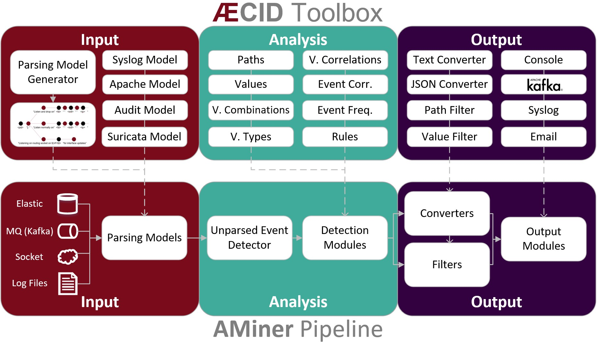

========
Overview
========

The logdata-anomaly-miner can be configured in two different formats: **yaml** and **python**. The preferred format is yaml and the default configuration file for it is */etc/aminer/config.yaml*. The python format can be configured in */etc/aminer/config..py* and offers more different ways to configure the logdata-anomaly-miner. However, this is only recommended for experts, as no errors are caught in the python configuration, which can make debugging very difficult. For both formats there are template configurations in */etc/aminer/template\_config.yaml* and */etc/aminer/template\_config.py*.

The basic structure of the logdata-anomaly-miner is illustrated in the folloging diagram:

-----------------
Analysis Pipeline
-----------------

The core component of the logdata-anomaly-miner is the "analysis pipeline". It consists of the parts INPUT, ANALYSIS and OUTPUT

=======================
Configuration Reference
=======================

---------------------
General Configuration
---------------------

Supported settings:

LearnMode
~~~~~~~~~

* Type: boolean (True,False)
* Default: False

This options turns the LearnMode on globally.

.. warning:: This option can be overruled by the learn_mode that is configurable per analysis component.

.. code-block:: yaml

   LearnMode: True

AminerUser
~~~~~~~~~~

* Default: aminer

This option defines the system-user that owns the aminer-process.

.. code-block:: yaml

   AminerUser: 'aminer'

AminerGroup
~~~~~~~~~~~

* Default: aminer

This option defines the system-group that owns the aminer-process.

.. code-block:: yaml

   AminerGroup: 'aminer'

RemoteControlSocket
~~~~~~~~~~~~~~~~~~~

This option controls where the unix-domain-socket for the RemoteControl should be created. The socket will not be created if this option was not set.

.. code-block:: yaml

   RemoteControlSocket: '/var/lib/aminer/remcontrol.sock'

SuppressNewMatchPathDetector
~~~~~~~~~~~~~~~~~~~~~~~~~~~~

* Default: False
* Type: boolean (True,False)

Disable the NewMatchPathDetector which detects new paths for logtypes.

.. code-block:: yaml

   SuppressNewMatchPathDetector: 'False'

LogResourceList
~~~~~~~~~~~~~~~

* Required: **True**
* Resource-Types: ``file://``, ``unix://``

Define the list of log resources to read from: the resources named here do not need to exist when aminer is started. This will just result in a warning. However if they exist, they have to be readable by the aminer process!

Supported types are:

* file://[path]: Read data from file, reopen it after rollover
* unix://[path]: Open the path as UNIX local socket for reading

.. code-block:: yaml

   LogResourceList:
       - 'file:///var/log/apache2/access.log' 
       - 'file:///home/ubuntu/data/mail.cup.com-train/daemon.log'
       - 'file:///home/ubuntu/data/mail.cup.com-train/auth.log'
       - 'file:///home/ubuntu/data/mail.cup.com-train/suricata/eve.json'
       - 'file:///home/ubuntu/data/mail.cup.com-train/suricata/fast.log'

Core.PersistenceDir
~~~~~~~~~~~~~~~~~~~

* Default: /var/lib/aminer

Read and store information to be used between multiple invocations of aminer in this directory. The directory must only be accessible to the 'AminerUser' but not group/world readable. On violation, aminer will refuse to start.

.. code-block:: yaml

   Core.PersistenceDir: '/var/lib/aminer'

Core.PersistencePeriod
~~~~~~~~~~~~~~~~~~~~~~

* Type: Number of seconds
* Default: 600

This options controls the logdata-anomaly-miner should write it's persistency to disk.

.. code-block:: yaml

   Core.PersistencePeriod: 600

Core.LogDir
~~~~~~~~~~~

* Default: /var/lib/aminer/log

Directory for logfiles. This directory must be writeable to the 'AminerUser'.

.. code-block:: yaml

   Core.LogDir: '/var/lib/aminer/log'

MailAlerting.TargetAddress
~~~~~~~~~~~~~~~~~~~~~~~~~~

* Default: disabled

Define a target e-mail address to send alerts to. When undefined no e-mail notification hooks are added.

.. code-block:: yaml

   MailAlerting.TargetAddress: 'root@localhost'

MailAlerting.FromAddress
~~~~~~~~~~~~~~~~~~~~~~~~

Sender address of e-mail alerts. When undefined, "sendmail" implementation on host will decide, which sender address should be used.

.. code-block:: yaml

   MailAlerting.FromAddress: 'root@localhost'

MailAlerting.SubjectPrefix
~~~~~~~~~~~~~~~~~~~~~~~~~~

* Default: "aminer Alerts"

Define, which text should be prepended to the standard aminer subject.

.. code-block:: yaml

   MailAlerting.SubjectPrefix: 'aminer Alerts:'

MailAlerting.AlertGraceTime
~~~~~~~~~~~~~~~~~~~~~~~~~~~

* Type: Number of seconds
* Default: 0 (any event can immediately trigger alerting)

Define a grace time after startup before aminer will react to an event and send the first alert e-mail.

.. code-block:: yaml

   MailAlerting.AlertGraceTime: 0

MailAlerting.EventCollectTime
~~~~~~~~~~~~~~~~~~~~~~~~~~~~~

* Type: Number of seconds
* Default: 10

Define how many seconds to wait after a first event triggered the alerting procedure before really sending out the e-mail. In that timespan, events are collected and will be sent all using a single e-mail.

.. code-block:: yaml

   MailAlerting.EventCollectTime: 10

MailAlerting.MinAlertGap
~~~~~~~~~~~~~~~~~~~~~~~~

* Type: Number of seconds
* Default: 600

Define the minimum time between two alert e-mails in seconds to avoid spamming. All events during this timespan are collected and sent out with the next report.

.. code-block:: yaml

   MailAlerting.MinAlertGap: 600

MailAlerting.MaxAlertGap
~~~~~~~~~~~~~~~~~~~~~~~~

* Type: Number of seconds
* Default: 600

Define the maximum time between two alert e-mails in seconds. When undefined this defaults to "MailAlerting.MinAlertGap". Otherwise this will activate an exponential backoff to reduce messages during permanent error states by increasing the alert gap by 50% when more alert-worthy events were recorded while the previous gap time was not yet elapsed.

.. code-block:: yaml

   MailAlerting.MaxAlertGap: 600

MailAlerting.MaxEventsPerMessage
~~~~~~~~~~~~~~~~~~~~~~~~~~~~~~~~

* Type: Number of events
* Default: 1000

Define how many events should be included in one alert mail at most.

.. code-block:: yaml

   MailAlerting.MaxEventsPerMessage: 1000

LogPrefix
~~~~~~~~~

This option defines the prefix for the output of each anomaly.

.. code-block:: yaml

   LogPrefix: ''

Log.StatisticsPeriod
~~~~~~~~~~~~~~~~~~~~

* Type: Number of seconds
* Default: 3600

Defines how often to write into stat-logfiles.

.. code-block:: yaml
   
   Log.StatisticsPeriod: 3600

Log.StatisticsLevel
~~~~~~~~~~~~~~~~~~~

* Type: Number of loglevel
* Default: 1

Defines the loglevel for the stat logs.

.. code-block:: yaml
   
   Log.StatisticsLevel: 2

Log.DebugLevel
~~~~~~~~~~~~~~

* Type: Number of loglevel
* Default: 1

Defines the loglevel of the aminer debug-logfile.

.. code-block:: yaml
   
   Log.DebugLevel: 2

Log.RemoteControlLogFile
~~~~~~~~~~~~~~~~~~~~~~~~

* Default: '/var/lib/aminer/log/aminerRemoteLog.txt'
* Type: string (path to the logfile)

Defines the path of the logfile for the RemoteControl.

.. code-block:: yaml

   Log.RemoteControlLogFile: '/var/log/aminerremotecontrol.log'

Log.StatisticsFile
~~~~~~~~~~~~~~~~~~

* Default: '/var/lib/aminer/log/statistics.log'
* Type: string (path to the logfile)

Defines the path of the stats-file.

.. code-block:: yaml

   Log.StatisticsFile: '/var/log/aminer-stats.log'

Log.DebugFile
~~~~~~~~~~~~~~~~~~

* Default: '/var/lib/aminer/log/aminer.log'
* Type: string (path to the logfile)

Defines the path of the debug-log-file.

.. code-block:: yaml

   Log.DebugFile: '/var/log/aminer.log'

-----
Input
-----

timestamp_paths
~~~~~~~~~~~~~~~

* Type: string or list of strings

Parser paths to DateTimeModelElements to set timestamp of log events.

.. code-block:: yaml

   timestamp_paths: '/model/time'

.. code-block:: yaml

   timestamp_paths: 
      - '/parser/model/time'
      - '/parser/model/type/execve/time'
      - '/parser/model/type/proctitle/time'
      - '/parser/model/type/syscall/time'
      - '/parser/model/type/path/time'

multi_source
~~~~~~~~~~~~

* Type: boolean (True,False)
* Default: False

Flag to enable chronologicly correct parsing from multiple input-logfiles.

.. code-block:: yaml

   multi_source: True

verbose
~~~~~~~

* Type: boolean (True,False)
* Default: False

Flag to enable that detailed information is shown for unparsed loglines.

.. code-block:: yaml

   verbose: True

eol_sep
~~~~~~~

* Default: '\n'

End of Line seperator for events. 

.. note:: Enables parsing of multiline logs.

.. code-block:: yaml

   eol_sep: '\r\n'

json_format
~~~~~~~~~~~

* Type: boolean (True,False)
* Default: False

Enables parsing of logs in json-format.

.. code-block:: yaml

   json_format: True

-------
Parsing
-------

---------
Analysing
---------

-------------
EventHandling
-------------
